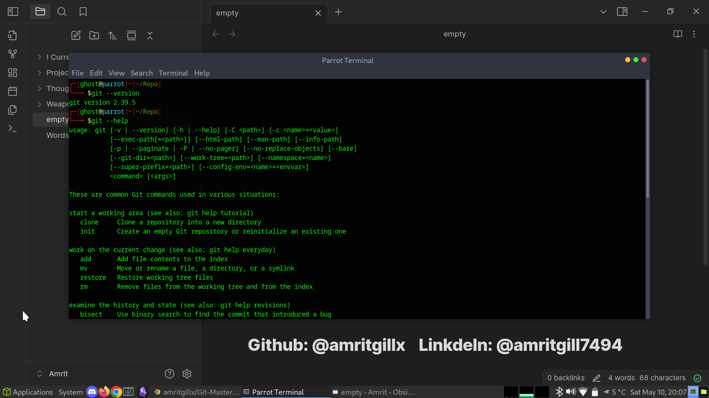

# 01 - Getting Started with Git

This section covers the fundamentals of Git, including installation, configuration, and core concepts.

---

## What is Git?

Git is a distributed version control system (VCS) that allows teams and individuals to track and manage changes in code and documents. It was originally created by Linus Torvalds in 2005 for the development of the Linux kernel.

**Why Git?**

- Tracks every change with full history
- Allows collaboration with branching and merging
- Is decentralized: every user has a full copy of the repository
- Extremely fast and efficient
- Open-source and widely adopted in software development

**Git vs GitHub**

Git is the actual version control system. GitHub is a cloud-hosted platform to store Git repositories and enable collaborative features like pull requests, issues, and project boards.

---

## Verifying Git Installation

I verified that Git is installed on my system using the following command:

```
git --version
```


---

## Exploring the Git Help System

I explored the help system built into Git by running:

git --help
These commands display documentation for commands and usage examples.



---

## Configuring Git Identity

I set my global Git identity to associate commits with my name and email:

```
git config --global user.name "Amrit"
git config --global user.email "amritgill7494@gmail.com"
```

I confirmed the configuration using:
git config --list


---

## Initializing a Test Git Repository

To familiarize myself with initializing a repository, I created a test folder and ran:

```
mkdir test-git-repo
cd test-git-repo
git init
```


---

## Core Git Concepts

* **Repository**: The complete history of all project files and changes.
* **Working Directory**: Local copy of files where changes are made.
* **Staging Area (Index)**: A place to prepare files before committing them to history.
* **Commit History**: Record of snapshots of the project at different points.
* **Branches**: Parallel versions of the repository for isolated development.

---

## Summary

In this section, I verified my Git installation, configured my identity, explored built-in documentation, and initialized my first local test repository. This forms the foundational setup before moving into practical Git workflows in the next labs.

---

