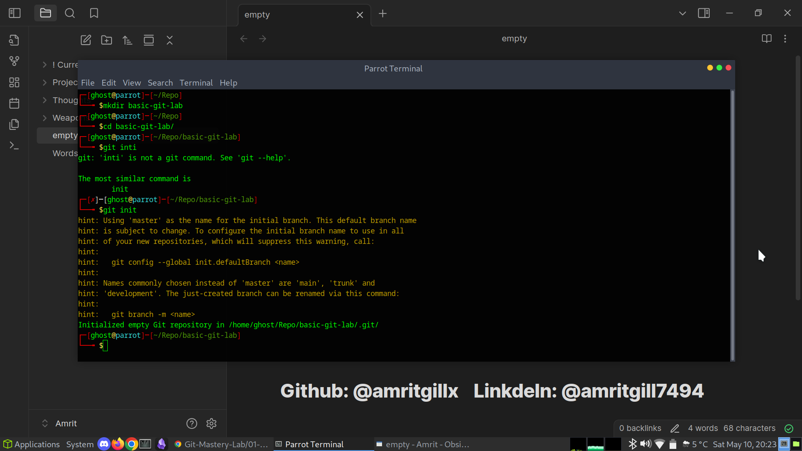

# 02 - Basic Git Commands

This section demonstrates a basic Git workflow as a single developer working locally.  
I practiced creating files, tracking them with Git, committing changes, and exploring history and file-level contributions.

---

## Initializing a Git Repository

I created a new folder and initialized a Git repository:

mkdir basic-git-lab
cd basic-git-lab
git init

---

## Creating Files

I created two text files to track in the repository:

echo "This is file 1" > file1.txt
echo "This is file 2" > file2.txt

---

## Checking Repository Status

I checked the repository status to see which files were untracked:

git status

---

## Staging and Committing Files

### Stage and commit the first file:

git add file1.txt
git commit -m "Add file1.txt"

### Stage and commit the second file:

git add file2.txt
git commit -m "Add file2.txt"

---

## Viewing Commit History

I explored the commit history using:

git log

---

## Viewing File History with Blame

I used `git blame` to see which commit and author last changed each line of `file1.txt`:

git blame file1.txt

---

## Updating a File and Committing the Change

I modified `file1.txt` and committed the change:

echo "Adding new line to file1" >> file1.txt
git add file1.txt
git commit -m "Update file1.txt with new line"

---

## Summary

In this lab I practiced:

* Initializing a repository
* Tracking files with `git add`
* Saving changes with `git commit`
* Inspecting project history with `git log`
* Viewing file-level change history with `git blame`

This forms the core of everyday Git usage as a developer.

---

