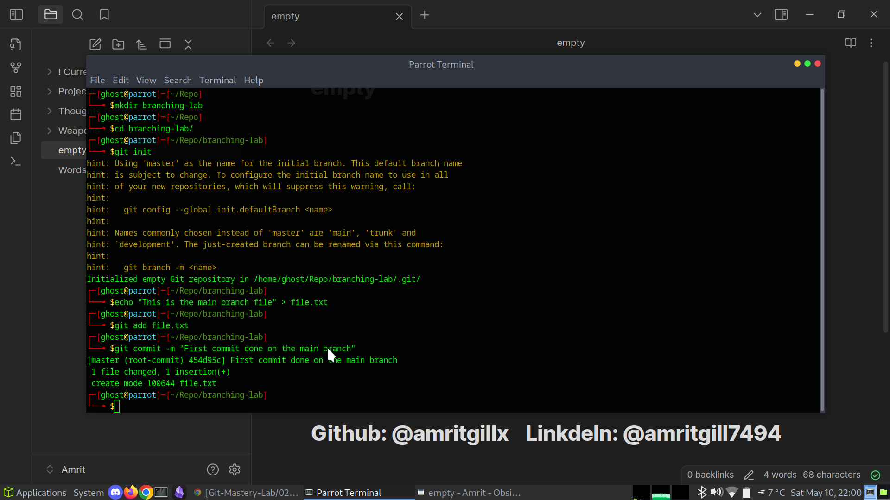
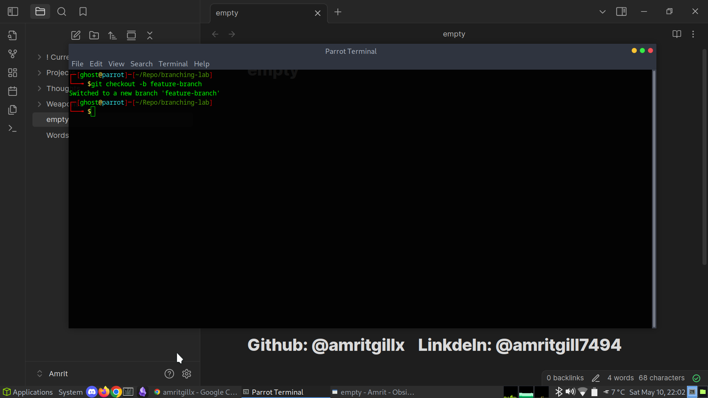
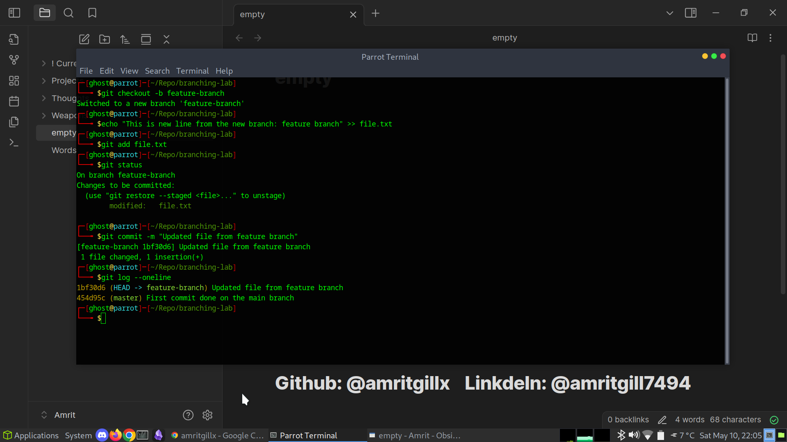
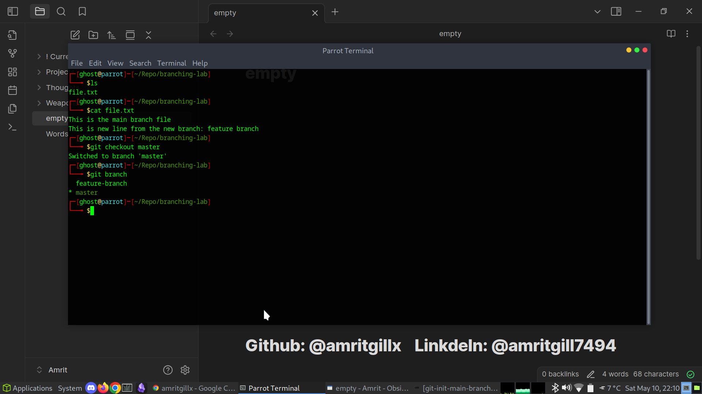
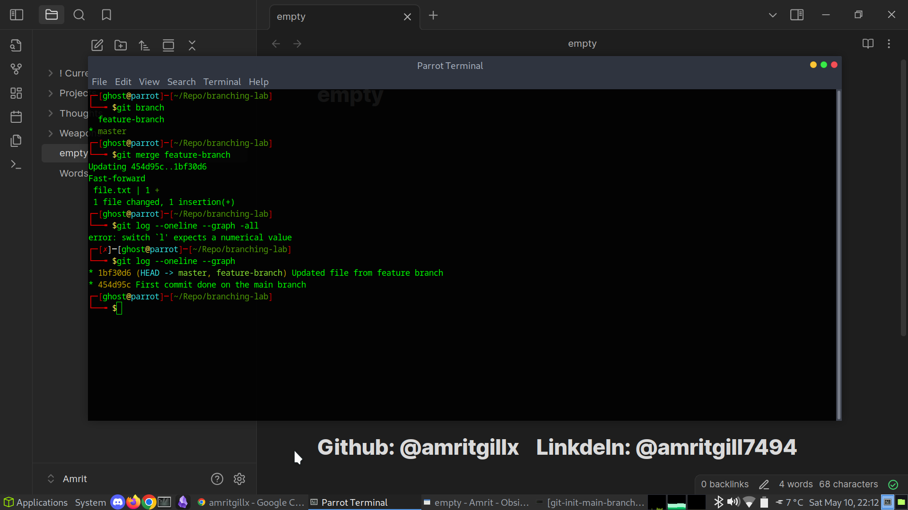
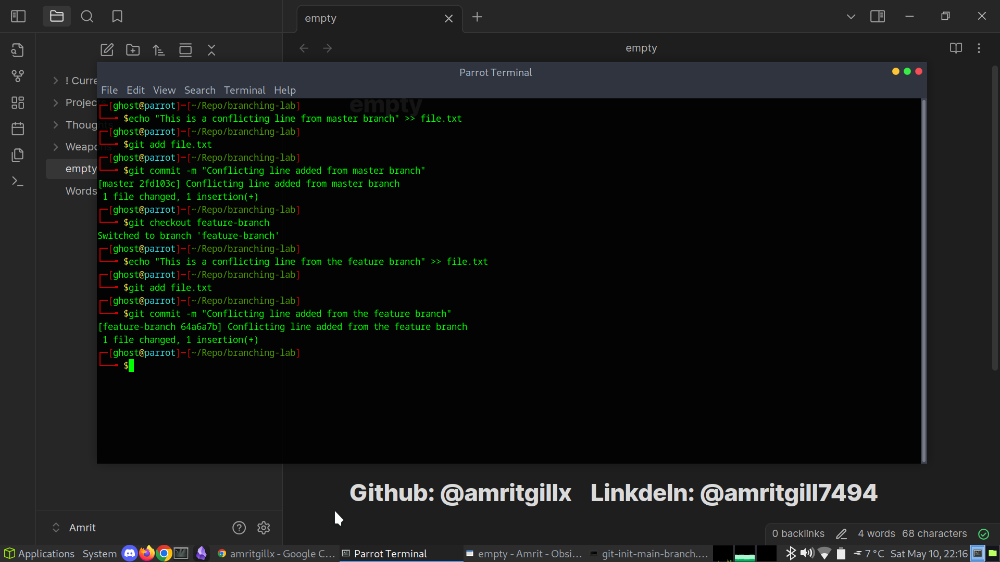
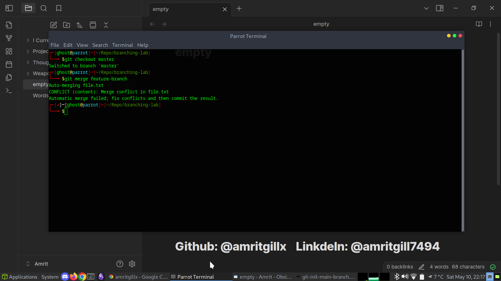
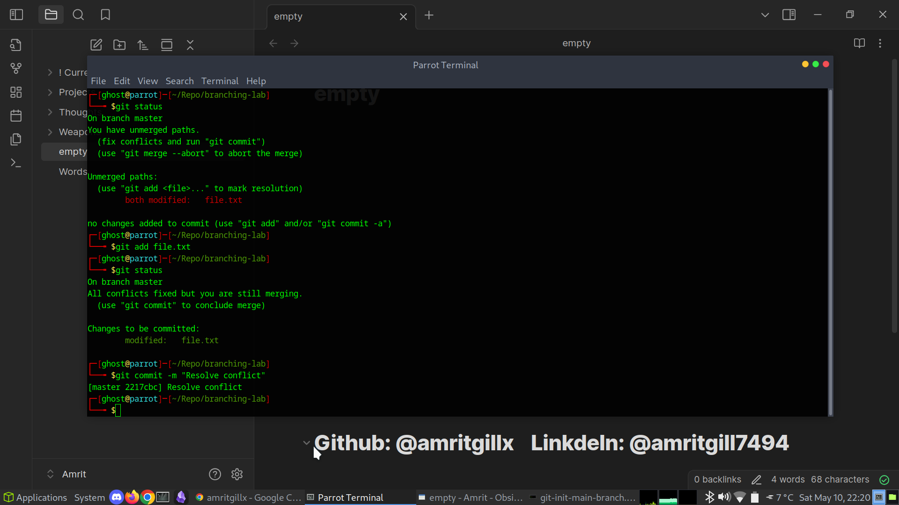

# 03 - Branching and Merging

This section demonstrates how to use Git branches to isolate work and merge changes back into the master branch.  
I also simulated a merge conflict and resolved it to practice real-world collaboration scenarios.

---

## Initializing the Repository

I initialized a test repository and committed a starting file:

mkdir branching-lab
cd branching-lab
git init
echo "This is the main branch file" > file.txt
git add file.txt
git commit -m "Initial commit on main branch"

---

## Creating and Switching to a New Branch

I created a new feature branch and switched to it:

git checkout -b feature-branch

---

## Making Changes on Feature Branch

I modified `file.txt` and committed the change:

echo "This is a new line from feature branch" >> file.txt
git add file.txt
git commit -m "Update file.txt from feature branch"

---

## Switching Back to Master Branch

I switched back to the master branch to prepare for merging:

git checkout master

---

## Merging the Feature Branch into Master

I merged the feature branch into master successfully:

git merge feature-branch

---

## Simulating and Resolving a Merge Conflict

To simulate a conflict, I made different edits to `file.txt` on both branches before merging:

### On master branch:

echo "This is a conflicting line from master" >> file.txt
git add file.txt
git commit -m "Add conflicting line on master"

### On feature branch:

git checkout feature-branch
echo "This is a conflicting line from feature branch" >> file.txt
git add file.txt
git commit -m "Add conflicting line on feature branch"

### Merge conflict occurred:
git checkout master
git merge feature-branch

I manually edited the file to resolve the conflict, then staged and committed the resolved file:
Sorry, I forgot to take the screenshot for this step where I made changes inside the text file.

git add file.txt
git commit -m "Resolve merge conflict"

---

## Summary

In this lab I practiced:

* Creating branches with `git checkout -b`
* Switching between branches with `git checkout`
* Merging feature work back into the master branch
* Simulating and resolving merge conflicts

This gave me confidence working with branching workflows and understanding how to manage conflicts during merges.

