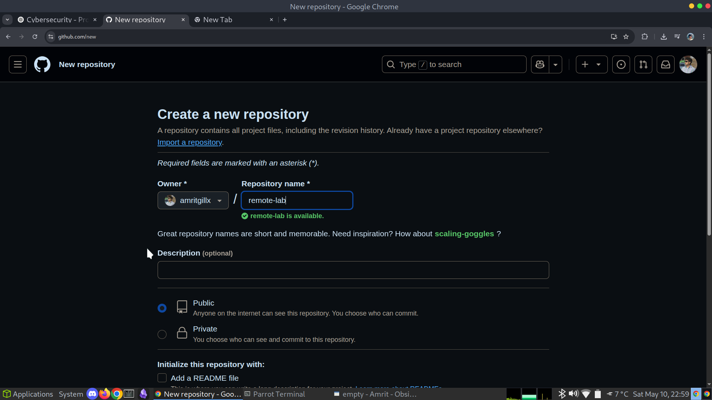
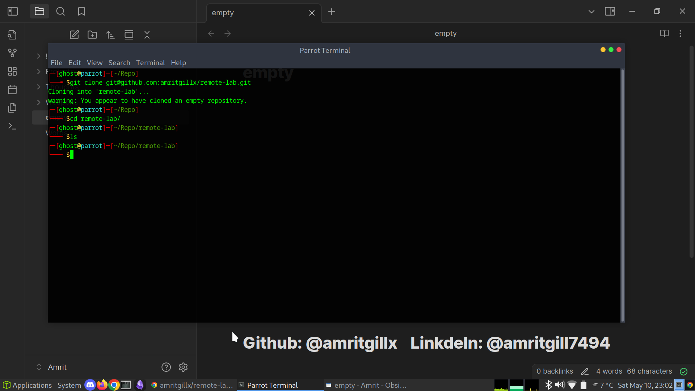
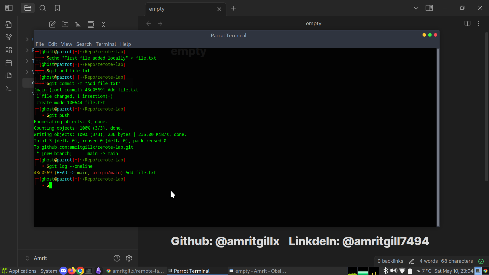
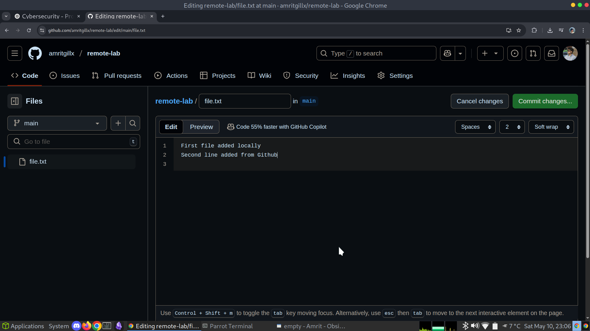
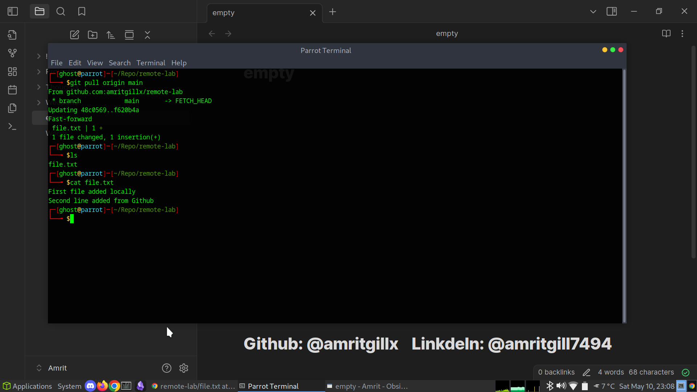

# 04 - Remote Repos and GitHub

This section demonstrates how to work with remote repositories hosted on GitHub.  
I practiced cloning a remote repo, pushing local changes, pulling changes from the remote, and updating files both locally and remotely.

---

## Creating a Remote Repository

I created a new remote repository on GitHub named `remote-lab`.

---

## Cloning the Remote Repository Locally

I cloned the remote repository using SSH:

git clone git@github.com:amritgillx/remote-lab.git
cd remote-lab

---

## Adding a File and Pushing Changes

I created a new file locally, committed it, and pushed it to the remote repository:

echo "First file added locally" > file.txt
git add file.txt
git commit -m "Add file.txt"
git push origin main

The file appeared in the remote repository on GitHub.

---

## Simulating Changes from GitHub and Pulling Updates Locally

I manually edited `file.txt` directly from the GitHub web interface and committed the change.

I then pulled the remote changes to my local repository:

git pull origin main

---

## Summary

In this lab I practiced:

* Creating and cloning a remote repository
* Connecting a local repository to a remote (`git remote`)
* Pushing local changes to GitHub (`git push`)
* Pulling remote changes to local (`git pull`)
* Understanding the basic GitHub + Git collaboration workflow

This provided a strong foundation for working with remotes, which is essential for real-world projects.

