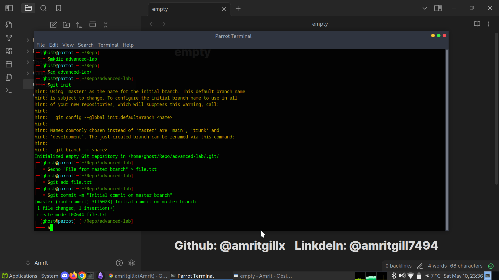
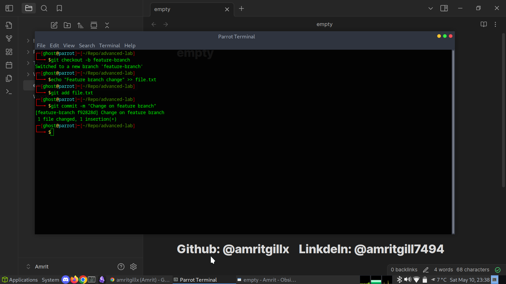
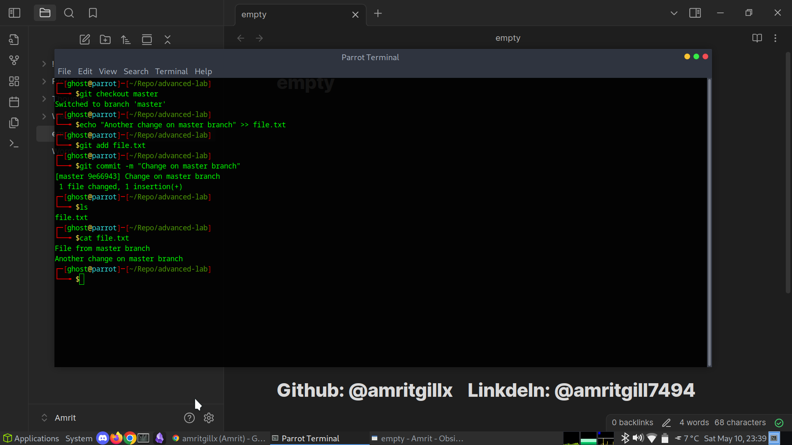
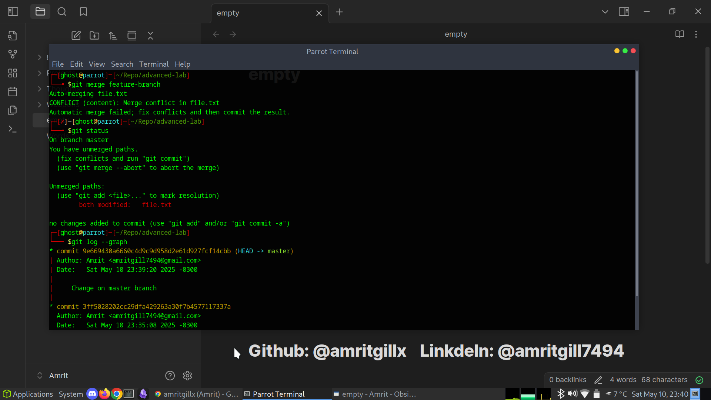
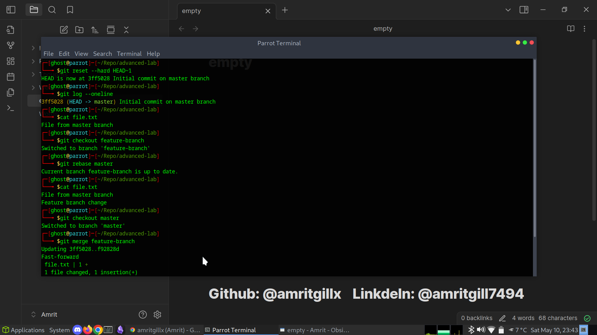
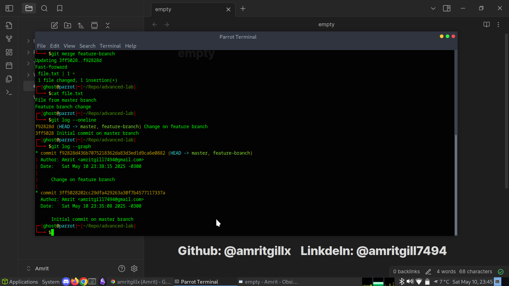
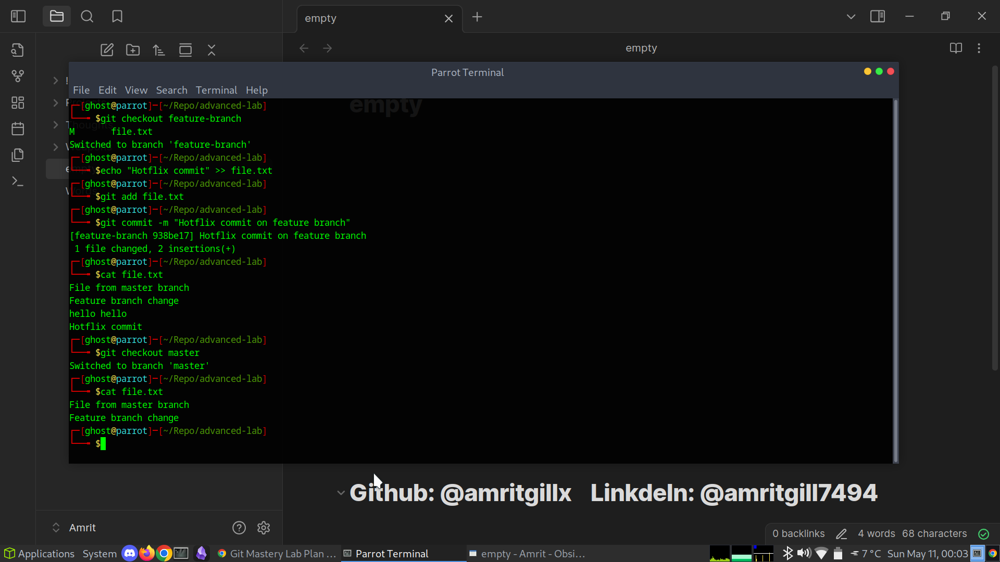
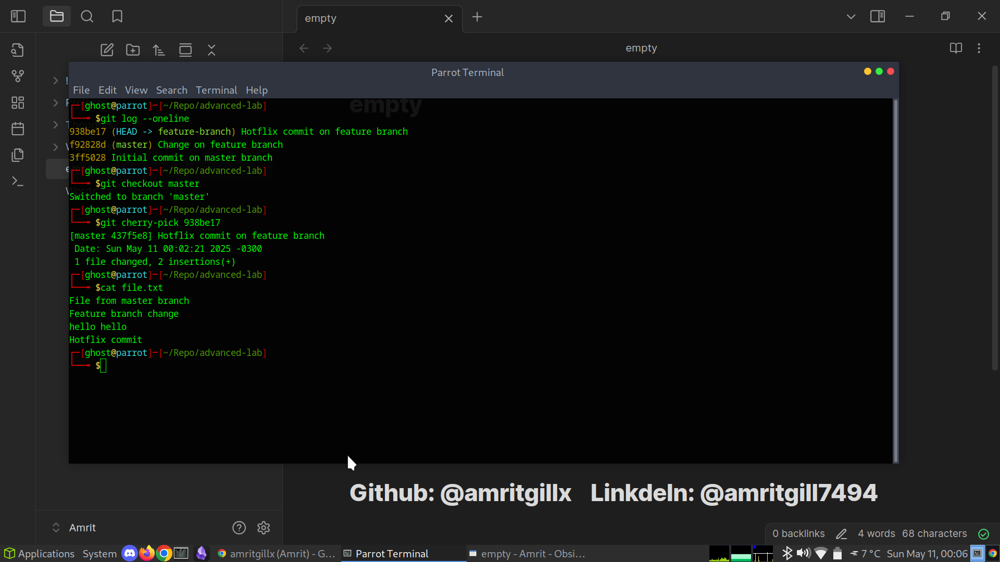

# 05 - Advanced Git Features

This section covers advanced Git skills including working with feature branches, merging, rebasing, and cherry-picking commits.  
These commands are essential for managing complex real-world development workflows.

---

## Creating the Repository and Master Branch

I created a new repository and made an initial commit on the `master` branch:

mkdir advanced-lab
cd advanced-lab
git init
echo "File from master branch" > file.txt
git add file.txt
git commit -m "Initial commit on master branch"

---

## Creating a Feature Branch

I created and switched to a new feature branch:

git checkout -b feature-branch

---

## Making Changes On master branch:

git checkout master
echo "Another change on master branch" >> file.txt
git add file.txt
git commit -m "Change on master branch"

---

## Merging Feature Branch into Master

I attempted to merge `feature-branch` into `master`, which caused a merge conflict:

git merge feature-branch

I resolved the conflict manually by editing `file.txt`, then staged and committed:

git add file.txt
git commit -m "Resolve merge conflict"

---

## Rebase vs Merge Demonstration

I reset the merge and demonstrated a rebase workflow:

git reset --hard HEAD~1
git checkout feature-branch
git rebase master
git checkout master
git merge feature-branch

---

### The Core Difference

| Merge                                             | Rebase                                                    |
| ------------------------------------------------- | --------------------------------------------------------- |
| Combines changes by creating a new “merge commit” | Combines changes by rewriting history (replaying commits) |
| Keeps all history, shows “branching”              | Makes it look like you worked directly on master branch   |
| Safer for teams (no history change)               | Cleaner, linear history (good for personal branches)      |

Both get your work + the latest changes together. They just present the history differently.

---

## Cherry-pick a Commit

On `feature-branch`, I created a small commit:

echo "Hotfix commit" >> file.txt
git add file.txt
git commit -m "Hotfix commit on feature branch"

Then on `master`, I cherry-picked that commit:

git checkout master
git cherry-pick <commit-hash>

---

## Summary

In this lab I practiced:

* Difference between merging and rebasing
* Handling merge conflicts
* Copying commits between branches with cherry-pick
* Understanding how history can be visualized with `git log --graph`

This knowledge is essential for advanced teamwork and clean commit history management in large projects.

