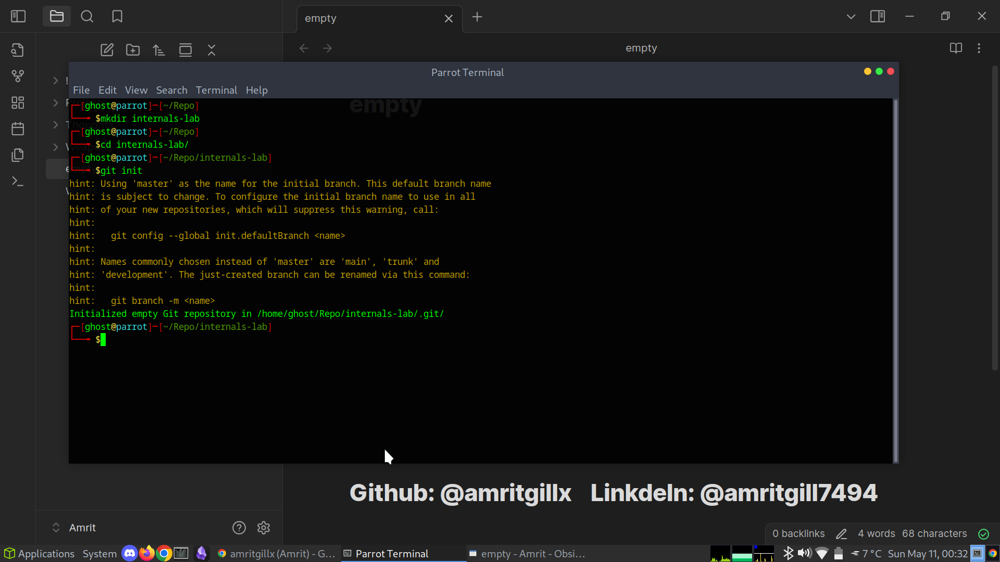
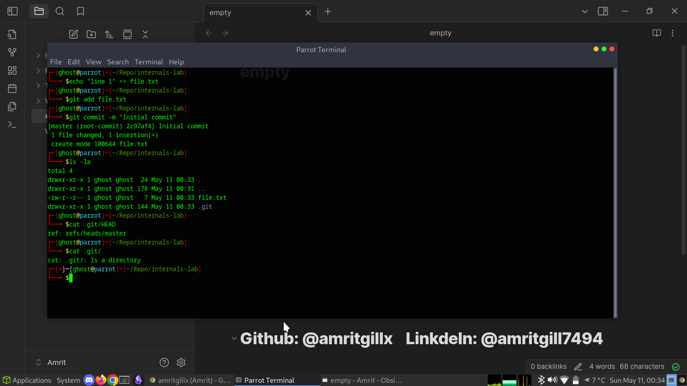
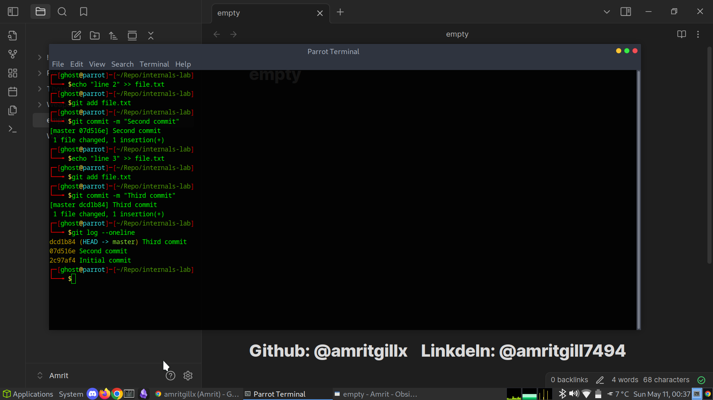
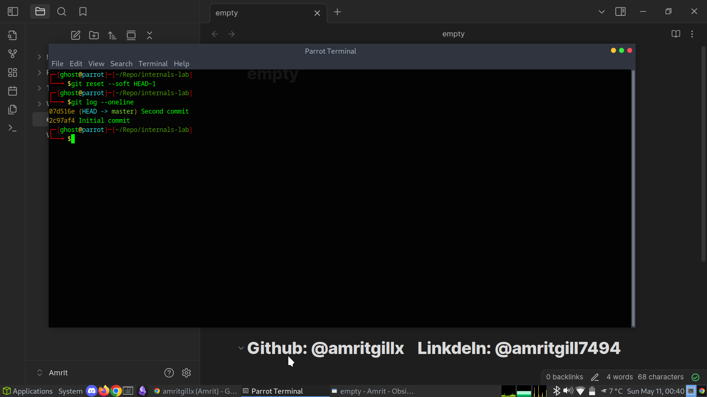
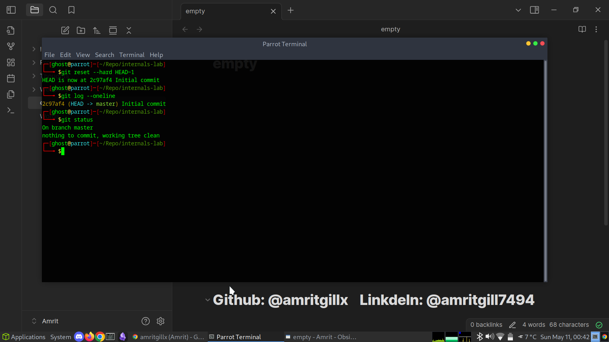
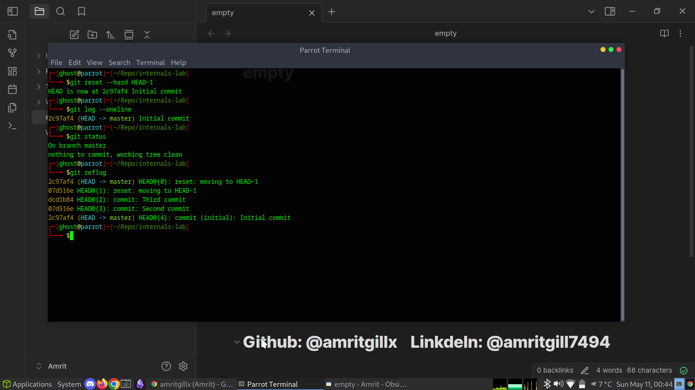
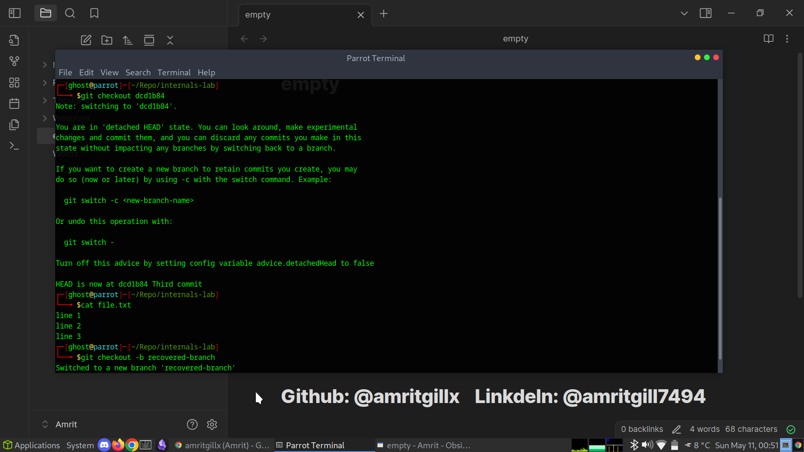
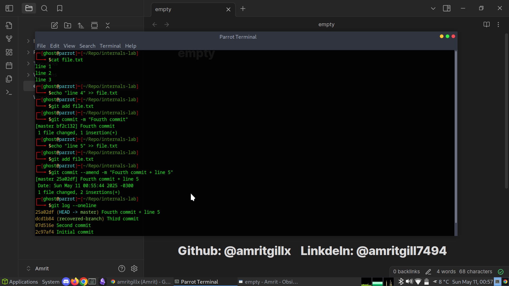

# 06 - Git Internals

This section explores how Git works under the hood.
I experimented with the staging area, `HEAD`, `reset`, `reflog`, and `commit --amend`.
These commands are essential for understanding and recovering from mistakes.

---

## Initializing the Repository

I created a new test repository:

mkdir internals-lab
cd internals-lab
git init

---

## Understanding HEAD

`HEAD` is a reference to the current commit (usually the tip of the current branch).
I viewed the contents of `.git/HEAD`:

cat .git/HEAD

---

## Committing Changes

I created a file and made three commits:

echo "line 1" > file.txt
git add file.txt
git commit -m "Initial commit"

echo "line 2" >> file.txt
git add file.txt
git commit -m "Second commit"

echo "line 3" >> file.txt
git add file.txt
git commit -m "Third commit"

### Output of log:

git log --oneline

## Using `git reset`

### Soft Reset

Moves HEAD but leaves files staged.

git reset --soft HEAD~1
git log --oneline

### Hard Reset

Moves HEAD and discards all uncommitted changes:

git reset --hard HEAD~1
git log --oneline

---

## Using `git reflog` to Recover Commits

After my hard reset, I was able to view past HEAD positions with:

git reflog

---

### Recovering Deleted Commits

`git reflog` lists every HEAD movement:
To recover a lost commit:

git checkout def5678

This puts you in detached HEAD at that commit.
To save it as a branch:

git checkout -b recovered-branch

This is how lost work can be recovered even after destructive commands like `reset --hard`.

---

## Using `git commit --amend`

I made a new commit, then amended it to include additional changes:

echo "line 4" >> file.txt
git add file.txt
git commit -m "Fourth commit"

echo "line 5" >> file.txt
git add file.txt
git commit --amend -m "Fourth commit + line 5"

This allowed me to fix the last commit message and add forgotten changes.

---

## Summary

In this lab I learned:

* How `HEAD` points to the current commit
* The differences between soft and hard resets
* How `reflog` can be used to recover lost commits
* How `git commit --amend` can fix mistakes in the last commit

These are powerful tools that give confidence to experiment and recover from mistakes, which is essential in professional Git workflows.
