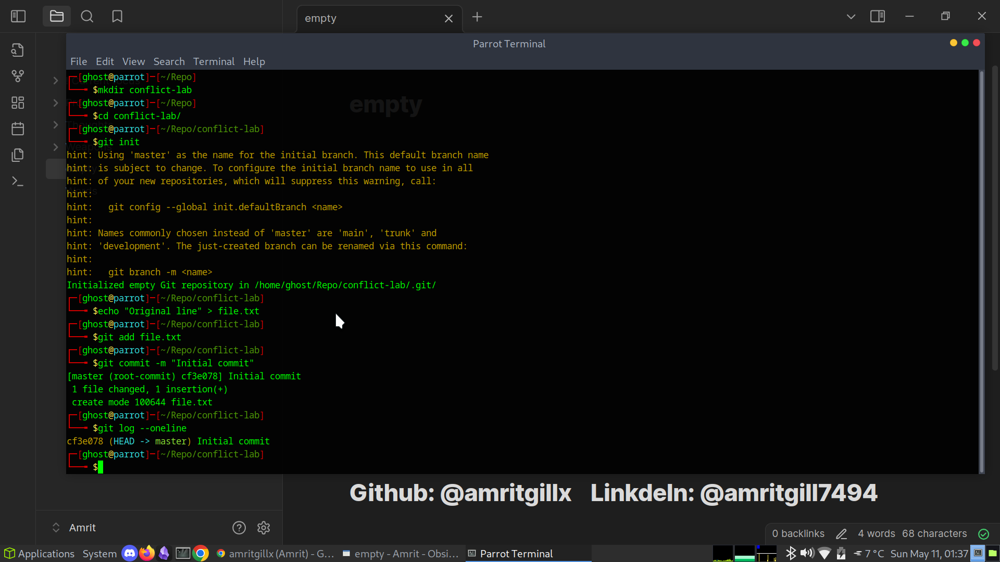
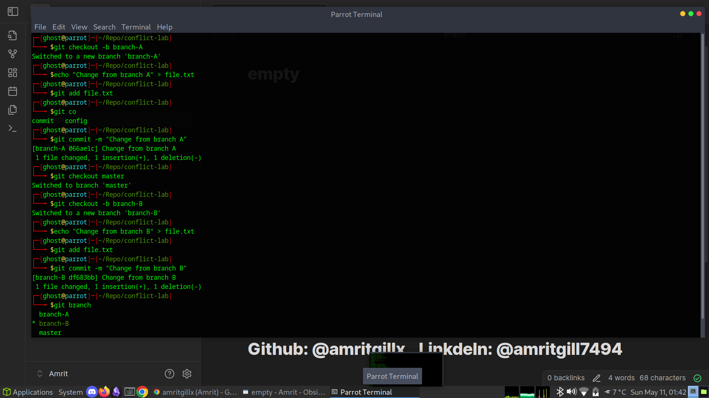
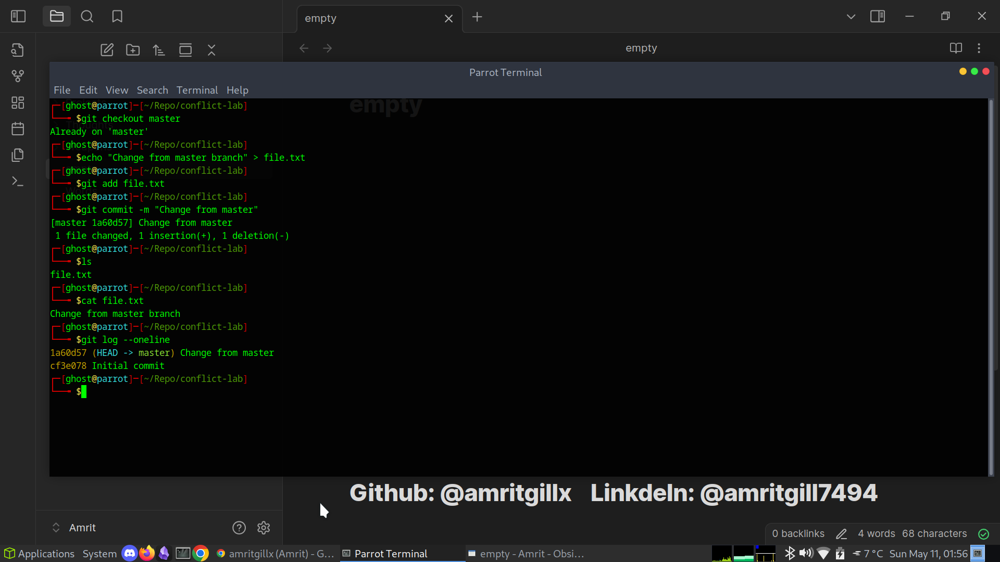
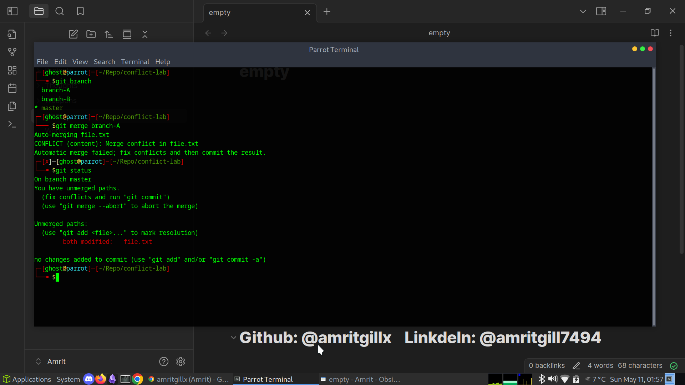
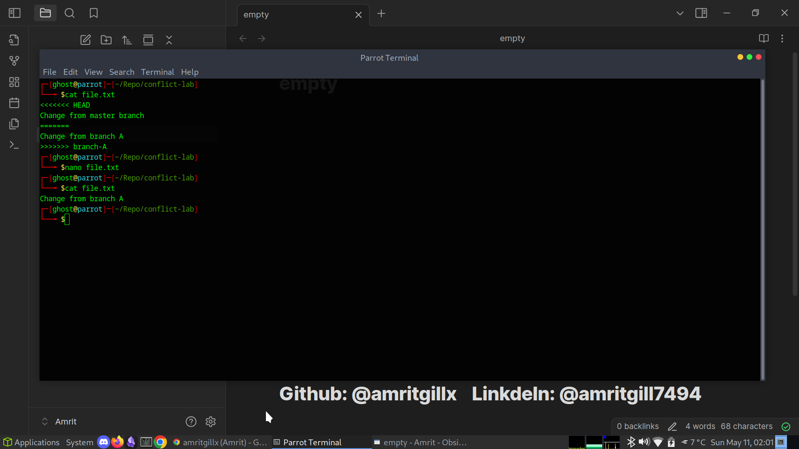
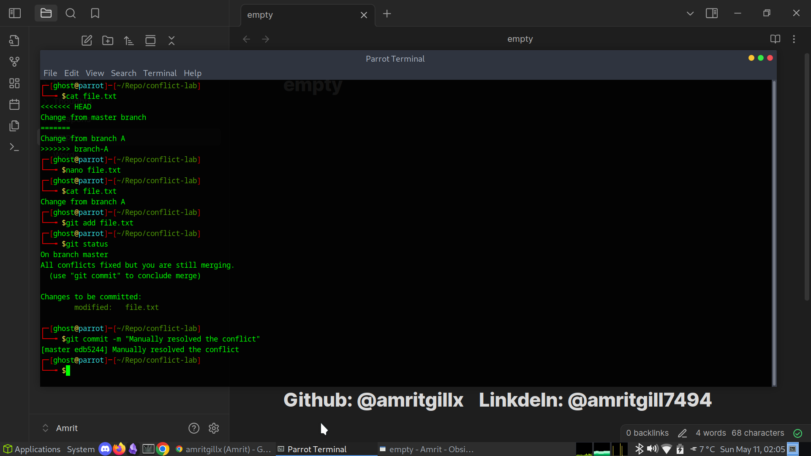
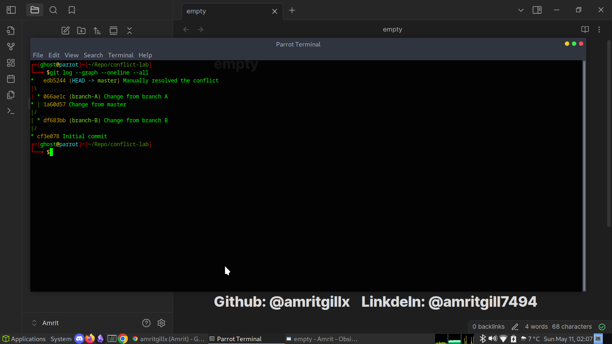

# 07 - Merge Conflict Lab

This section demonstrates how merge conflicts happen, how to detect them, and how to manually resolve them.  
Intentionally creating and resolving conflicts is an essential skill for real-world teamwork with Git.

---

## Repository Initialization

I created a new test repository and made an initial commit:

mkdir conflict-lab
cd conflict-lab
git init
echo "Original line" > file.txt
git add file.txt
git commit -m "Initial commit"

---

## Creating Two Conflicting Branches

I created two branches and modified `file.txt` differently on each:

git checkout -b branch-A
echo "Change from branch A" > file.txt
git add file.txt
git commit -m "Change from branch A"

git checkout master
echo "Change from master branch" > file.txt
git add file.txt
git commit -m "Change from master"

---

## Merging Branches and Causing a Conflict

I attempted to merge `branch-A` into `master`:

git merge branch-A

Since both branches had changes to the same file, Git detected a conflict.

---

## Viewing Conflict Markers

The file `file.txt` showed conflict markers:

<<<<<<< HEAD
Change from master branch
=======
Change from branch A
>>>>>>> branch-A

I opened the file to inspect the conflict:

---

## Resolving the Conflict

I manually edited `file.txt` to resolve the conflict:

Then I staged and committed the resolution:

git add file.txt
git commit -m "Manually resolved the conflict."

---

## Viewing Final Merge Graph

I used the following to visualize the resolved history:

git log --graph --oneline --all

---

## Summary

In this lab I learned:

* How to create a merge conflict by modifying the same file in two branches
* How Git marks the conflict with special markers
* How to manually edit, stage, and commit a resolved file
* How to visualize the merge result with `git log --graph`

This knowledge gives me confidence to resolve real-world merge conflicts safely and effectively.
